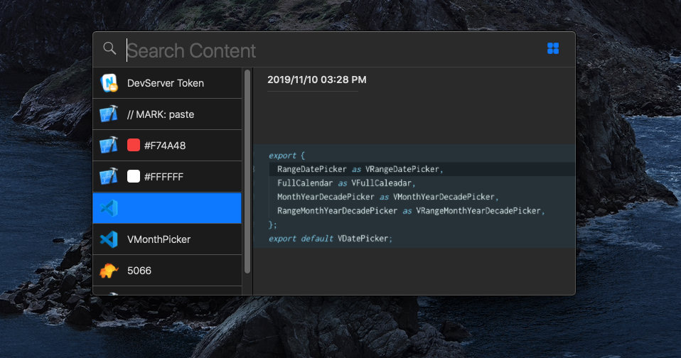

### N Clip Board

N Clip Board is a small ClipBoard management tool that helps you record and find your clip content quickly and easily. And It conforms to the `App Sandbox` requirement, which means it only access your content that being allowed to. It's opensource and free to use.

#### Installation

N Clip Board is currently in beta, so we haven't released the installer. If you want the beta version for now, you have to compile it from source.

