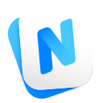

### N Clip Board



N Clip Board is a lightweight ClipBoard management tool that helps you record and find your clip content quickly and easily. And It conforms to the `App Sandbox` requirement, which means it only access your content that being allowed to. It's opensource and free of charge.


### System Requirement
`macOS High Sierra(10.13) and above`

### Installation

#### from our release 
You can download dmg installer from the [releases](https://github.com/poor-branson/N-Clip-Board/releases)

#### compile from source

- Fork the master(release) into your local.
- The least required xcode environment version should `9.3`
- Under the project root, execute
```shell
npm i && make
```
- Then, you could find installer under `build/`

happy hacking.